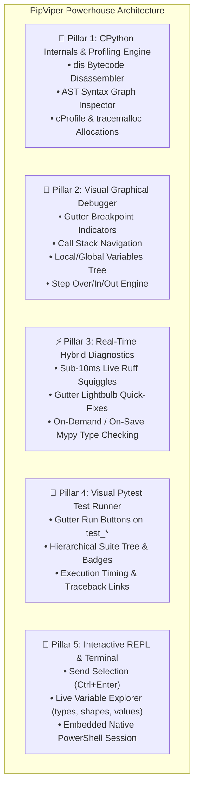
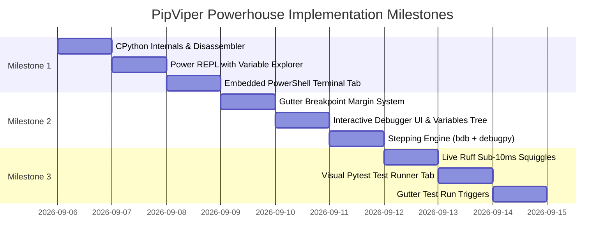

# PipViper IDE — Python Powerhouse Architectural Roadmap 🐍🚀

## 1. Vision & Core Philosophy
Transform PipViper from a clean lightweight editor into an elite, indispensable Python engineering workstation designed for serious Pythonistas and CPython core contributors alike. The system remains 100% offline-first, local-first, high-performance, and thread-safe, keeping the PySide6 main thread fluid while background workers perform heavy static analysis, bytecode inspection, profiling, and debugging.

---

## 2. The 5 Pillars of the Powerhouse Architecture

---

## 3. Detailed Subsystem Specifications

### Pillar 1: CPython Internals & Profiling Engine
- **Bytecode Disassembler (`dis`)**:
  - Automatically disassembles the active Python file, selected function, or code snippet into CPython opcodes (`LOAD_FAST`, `BINARY_OP`, `CALL`, `RETURN_VALUE`, etc.).
  - Maps bytecode instruction offsets to physical editor source lines.
  - Highlights jump targets and conditional branches.
- **AST Syntax Graph Inspector**:
  - Parses code via Python `ast` and renders an interactive, expandable tree structure (`Module` -> `FunctionDef` -> `Assign` -> `BinOp` -> ...).
  - Displays node attributes, variable names, docstrings, and line spans.
- **Execution & Memory Profiler**:
  - Function-level execution profiling via standard `cProfile` (calls, cumtime, tottime, per-call averages).
  - Memory allocation tracking via `tracemalloc` (peak memory, allocation hotspots per line).
  - Sortable tables with hot-spot color highlights.

### Pillar 2: Visual Graphical Debugger
- **Gutter Breakpoint System**:
  - Clickable line number margin in [LineNumberArea](file:///C:/Users/droxa/pip-viper/src/editor.py#L305): toggles bright red circular breakpoints.
  - Breakpoints persist across file edits with offset recalculation.
- **Debugger Control Toolbar**:
  - Start/Continue (`F5`), Step Over (`F10`), Step Into (`F11`), Step Out (`Shift+F11`), Stop (`Shift+F5`).
- **Call Stack & Variables Tree**:
  - Live call stack frame list; clicking jumps editor to that frame's execution line.
  - Expandable variables inspection tree showing local and global symbols, data types, lengths, and repr representations.
- **Dual-Engine Backend**:
  - Native `bdb`-based in-process/subprocess stepper for instant zero-latency local stepping.
  - External `debugpy` TCP port listener for remote and multi-threaded client debugging.

### Pillar 3: Real-Time Hybrid Diagnostics
- **Sub-10ms Ruff Live Linting**:
  - In-memory stdin execution (`ruff check --stdin-filename ... -`) triggered by debounced editor keystrokes (250ms).
  - Renders red error and yellow warning wavy squiggles directly on the active editor canvas.
  - Gutter markers and hover tooltips explaining the error code and message.
  - One-click quick-fixes (`ruff check --fix`) applied directly to the document.
- **On-Demand Mypy Static Type Checking**:
  - Deep type analysis run on file save or via explicit `F7` shortcut to prevent UI sluggishness during active editing.

### Pillar 4: Visual Pytest Test Runner
- **Gutter Test Triggers**:
  - Editor displays subtle green play buttons next to any `def test_*()` or `class Test*` declaration.
  - Clicking runs that specific test in the background.
- **Interactive Test Suite Tab**:
  - Left pane: Test suite tree displaying discovery results with real-time status badges:
    - 🟢 Passed (with timing, e.g., `test_login (12ms)`)
    - 🔴 Failed
    - 🟡 Running
    - ⚪ Skipped
  - Right pane: Rich failure traceback viewer with clickable file:line links jumping straight to assertion failures in the editor.
  - Suite actions: Run All, Run Failed Only, Re-run Active File.

### Pillar 5: Power REPL & Embedded PowerShell Terminal
- **Enhanced Python REPL**:
  - "Send Selection to REPL" (`Ctrl+Enter` / `Shift+Enter`) or "Run Current Line".
  - Multi-line indentation and syntax highlighting.
  - **Live Variable Explorer**: Dedicated table showing all variables currently residing in the REPL process namespace (`Name`, `Type`, `Size/Shape`, `Value Preview`).
- **Embedded Native Terminal Tab**:
  - A dedicated `💻 Terminal` bottom tab hosting an interactive Windows PowerShell / CMD session.
  - Allows seamless execution of `py`, `uv`, `git`, or system scripts right within the PipViper window.

---

## 4. Phased Implementation Roadmap

### Milestone 1: Interactive Execution & CPython Internals (Completed ⚡)
1. **CPython Internals Panel** (`🔬 Internals` tab): Bytecode disassembly (`dis`), AST interactive node tree, and `cProfile` / `tracemalloc` line profiler.
2. **Enhanced REPL**: Multi-line command dispatch, "Send Selection" shortcut (`Ctrl+Enter`), and live `Variable Explorer` table.
3. **Embedded Terminal**: PowerShell interactive process stream inside the bottom dock.
4. **Verification**: 100% unit tests covering panel widgets and AST/bytecode evaluators.

### Milestone 2: Visual Graphical Debugger (Completed ⚡)
1. **Editor Gutter Breakpoints**: Clickable margin toggle in [CodeEditor](file:///c:/Users/droxa/pip-viper/src/editor.py).
2. **Upgraded Debug Panel**: Call stack view, Locals/Globals inspector tree, Breakpoints manager, and Stepping controls (Continue, Step Over, Step Into, Step Out, Stop).
3. **Debugger Backend**: Integrated execution stepper with variable state capture.
4. **Verification**: Unit tests simulating breakpoints, stepping, and frame variable inspection.

### Milestone 3: Real-Time Diagnostics & Visual Testing (Completed ⚡)
1. **Live Ruff Diagnostics**: In-editor squiggly lines, hover tooltips, and quick-fixes.
2. **Visual Pytest Runner**: Discovery tree with pass/fail badges, execution durations, and interactive traceback viewer.
3. **Gutter Test Triggers**: One-click play buttons beside test functions.
4. **Verification**: Comprehensive integration tests across all diagnostic and testing components.

### Milestone 4: Navigation & Code Intelligence (Completed ⚡)
1. **Fuzzy Quick Open (`Ctrl+P`)**: Modal popup with fuzzy subsequence ranking, filename priority, and line jump (`:line`).
2. **Universal Command Palette (`Ctrl+Shift+P`)**: Global command launcher indexing all menu actions and shortcuts.
3. **Workspace Find in Files (`Ctrl+Shift+H`)**: Multi-threaded regex search tab with match badges and click-to-jump.
4. **Jedi Go-to-Definition (`F12` / `Ctrl+Click`)**: Cross-file definition navigation and cursor centering.
5. **Verification**: 100% automated test coverage across all navigation and search units.

### Milestone 5 / Phase 7: Elite Editor Craftsmanship (Completed ⚡)
1. **Code Folding**:
   - AST & indentation-aware range calculation for `def`, `class`, compound control blocks (`if`, `for`, `while`, `try`, `with`, `match`), and multi-line docstrings.
   - Interactive fold chevrons (`▼` / `▶`) rendered in [LineNumberArea](file:///c:/Users/droxa/pip-viper/src/editor.py) with gutter click toggling.
   - Keyboard shortcuts: Fold Current (`Ctrl+Shift+[`), Unfold Current (`Ctrl+Shift+]`), Fold All, Unfold All.
2. **Multi-Cursor Editing (`Ctrl+D` & `Alt+Click`)**:
   - Select next occurrence (`Ctrl+D`) with word boundary matching.
   - Arbitrary cursor insertion (`Alt+Click`).
   - Synchronous multi-cursor typing, backspace, deletion, and arrow navigation grouped into single atomic undo blocks.
   - Instant cancellation via `Esc`.
3. **Sticky Scroll Scope Headers**:
   - Pinned [StickyScopeBar](file:///c:/Users/droxa/pip-viper/src/editor.py) atop the editor displaying active scope breadcrumbs (`class ClassName` > `def method(...)`).
   - Real-time synchronization with editor viewport scrolling and click-to-jump navigation.
4. **Split Editor Panes**:
   - Side-by-side (`Ctrl+\`) and top-bottom (`Ctrl+Alt+\`) dual-pane viewing in [EditorTabs](file:///c:/Users/droxa/pip-viper/src/editor.py) via `QSplitter`.
   - Shared `QTextDocument` buffer synchronization ensuring simultaneous live updates.
5. **Verification**: 12 dedicated automated tests in `test_editor_craftsmanship.py` passing 100% with full test suite (142 tests) green.

---

### Milestone 6 / Phase 8: Self-Healing Environment Studio & Dependency Graph (Completed ⚡)
1. **Virtual Environment Auto-Detection & Interpreter Switcher**:
   - Multi-engine detection scanning project local virtualenvs (`.venv`, `venv`, `env`), Poetry virtualenvs (`%LOCALAPPDATA%\pypoetry\Cache\virtualenvs`), Conda environments (`~/.conda/environments.txt`, `CONDA_PREFIX`), Windows Python Launcher (`py -0p`), system `PATH`, and host Python.
   - Non-blocking fast version probing extracting `pyvenv.cfg` metadata in <1ms without launching slow interpreter subprocesses.
   - Interactive status bar widget displaying `🐍 Python <ver> (<name>)` with click-to-switch.
   - Searchable `EnvironmentPickerDialog` featuring type badges, path filtering, and custom interpreter file picker.
   - Global IDE runtime switching updating the linter, Jedi service, test runner, debugger, and dependency visualizer dynamically.
2. **Interactive Dependency Visualizer (Dependency Studio)**:
   - Dedicated dock panel (`🕸 Dependencies`) in bottom tabs.
   - Left tree widget with 3 view modes: *Hierarchy Tree*, *Flat Inventory*, *Outdated Only*.
   - Center visual graph view powered by `QGraphicsScene` and `QGraphicsView`: interactive draggable package nodes, directed requirement arrows, connection highlighting on selection, smooth pan/zoom (`+`, `-`, `Reset`), and Mermaid diagram export (`to_mermaid`).
   - Right inspector card displaying package version, summary, license, direct dependencies, reverse dependents (`Required by`), and 1-click Upgrade/Uninstall actions.
   - Offline-first package inspection via `importlib.metadata.distributions()` with zero external runtime dependencies.
3. **Self-Healing Import Resolver & Requirements Synchronizer**:
   - Real-time missing import detection mapping uninstalled module names (`PIL`, `cv2`, `yaml`, `serial`, `fitz`, etc.) to canonical PyPI distributions.
   - `SelfHealingBanner` atop the code editor with 1-click `⚡ Install <packages>` and `Ignore` actions.
   - Workspace-wide requirements synchronizer comparing `requirements.txt` against AST imports across all project `.py` files, surfacing missing and unused packages.
4. **Verification**: 12 dedicated automated tests across `test_environment.py`, `test_dependencies.py`, and `test_self_healing.py` passing 100% with full test suite (154 tests) green.

---

### Milestone 7 / Phase 9: Git VCS Powerhouse & Gutter Diffs (Completed ⚡)
1. **Git Service Engine (`src/vcs.py`)**:
   - Thread-safe `GitService` with asynchronous execution runner.
   - Non-blocking Git CLI porcelain status parsing, branch tracking, and commit history extraction.
   - Pure Python standard library `difflib`-based line hunk calculation computing exact line changes, type (`ADDED`, `MODIFIED`, `DELETED`), and original/modified line snippets.
2. **Editor Gutter Git Indicators & Revert Popup (`src/editor.py`)**:
   - Real-time colored diff margins in `LineNumberArea` (green bar for additions, blue bar for modifications, red arrow for deletions).
   - Interactive `DiffHunkPopup` on gutter click displaying original HEAD content and a 1-click `↺ Revert Change` button with instant buffer replacement.
3. **Visual Diff Viewer (`src/diff_viewer.py`)**:
   - `DiffViewerWidget` and modal `DiffViewerDialog` supporting both *Unified* and *Side-by-Side* split comparison modes.
   - Colorized syntax diff lines (`+` green, `-` red) and change counters (`+X -Y`).
   - Integrated stage, unstage, and discard action triggers.
4. **Upgraded Git Dock Panel (`src/panels.py`)**:
   - Modern `GitPanel` with branch switcher combo and branch creation dialog.
   - Staged changes and Unstaged changes trees with colored status badges (`M`, `A`, `D`, `?`, `R`, `U`).
   - Commit box with message validation, Amend checkbox, and 1-click Commit / Push / Pull actions.
   - Commit history timeline table with commit hash, author, and summary.
   - Collapsible Git command execution output log.
5. **Application & Status Bar Integration (`src/app.py`)**:
   - Status bar `GitBranchWidget` (`🌿 <branch>`) with click-to-switch and auto-refresh.
   - Debounced editor modification listener automatically recalculating gutter diff indicators in the background.
   - File save and tab switch hooks refreshing gutter diffs and Git panel state.
6. **Verification**: 25 dedicated automated tests across `tests/test_vcs.py`, `tests/test_diff_viewer.py`, `tests/test_gutter_diff.py`, and `tests/test_panels.py` passing 100% with full test suite (172 tests) green.

---

### Milestone 8 / Phase 10: Performance Profiling, Memory Tracking & Production Hardening (Completed ⚡)
1. **Execution Flame Graph & Call Hierarchy Visualizer (`src/profiler_visualizer.py`)**:
   - Complete `CallNode` and `CallerCalleeEntry` hierarchical data models.
   - Non-blocking `CallHierarchyBuilder` converting `pstats.Stats` into acyclic call trees with cycle/recursion pruning, depth limiting, and exact caller/callee relation mapping.
   - Interactive `FlameGraphCanvas` with stack-level layout, gradient color assignment, hover tooltips (total time, own time, call counts, percentage of parent), and click selection.
   - Rich `FlameGraphWidget` featuring dynamic zoom-to-frame, search query filtering, and interactive breadcrumbs navigation bar with reset capability.
   - `CallHierarchyView` displaying incoming callers and outgoing callees with call counts, self-time, and double-click navigation to editor source code.
2. **Memory Diagnostics & Snapshot Comparator (`src/memory_tracker.py`)**:
   - Zero-dependency cross-platform `ProcessMemorySampler` extracting working set, peak working set, private bytes, and allocated heap blocks (with native 64-bit safe Win32 `GetProcessMemoryInfo` ctypes bindings).
   - `MemorySnapshotComparator` calculating line-level memory deltas between baseline and comparative `tracemalloc` snapshots, identifying memory growth and suspect leaks.
   - `MemoryTrackerWidget` featuring 1-click baseline capture, live diff comparison, sortable delta table with leak suspect flags (`⚠️ LEAK`), allocation traceback drawer, and explicit garbage collection trigger (`🧹 Force GC`).
3. **Internals Studio Upgrade (`src/panels.py`) & Models (`src/internals.py`)**:
   - Upgraded Tab 4 of `InternalsPanel` into a 5-in-1 Performance & Diagnostics Studio (`🔥 Flame Graph`, `🌳 Call Hierarchy`, `⚡ Hotspots Table`, `💾 Memory & Leaks`, `📃 Output`).
   - Integrated double-click source navigation (`file_and_line_activated` signal) connecting profiler and memory tables directly to the active editor.
4. **Status Bar Memory Meter & Production Hardening (`src/widgets.py` & `src/app.py`)**:
   - Real-time `MemoryMeterWidget` in the status bar with periodic polling, working set / peak telemetry, GC trigger, and single-click shortcut to launch the Memory Studio.
   - Production crash resilience via `install_global_exception_handler()` capturing unhandled exceptions in `sys.excepthook`, recording detailed tracebacks to disk, and gracefully presenting user recovery dialogs without crashing the host process.
5. **Standalone Desktop Packaging (`desktop_packaging/`)**:
   - Comprehensive PyInstaller specification (`desktop_packaging/pip_viper.spec`) configured for standalone one-dir and single-file executables with all Qt, Jedi, and PySide6 metadata hooks.
   - Automated environment validation and headless smoke test script (`desktop_packaging/build_standalone.py`) verifying all 19 internal modules and runtime prerequisites.
6. **Verification**: 13 new dedicated automated unit tests across `tests/test_profiler_visualizer.py`, `tests/test_memory_tracker.py`, and `tests/test_production_hardening.py` passing 100%, with the complete 185-test regression suite passing in 3.67s.

---

